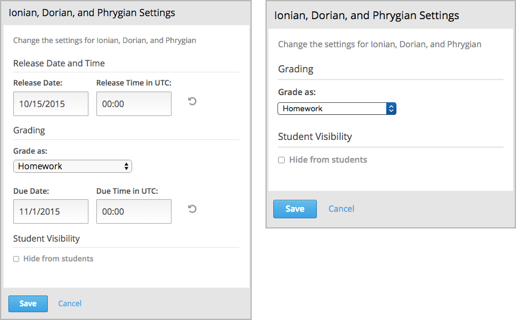

.. _Setting Course Pacing:

######################
Setting Course Pacing
######################

This topic describes how to set your course to follow a typical schedule or to
be a self-paced course.

.. contents::
  :local:
  :depth: 1

***************************
Overview of Course Pacing
***************************

When you run an edX course, you can decide whether you want to use a typical
course schedule or allow learners to work at their own pace. Courses that
follow a typical schedule are known as instructor-led courses. Courses that
allow learners to submit assignments at any time before the course ends,
without internal due dates, are known as self-paced courses.

.. note::
 You cannot change the course pacing after the course start date has passed.

**************************************
Instructor-Led and Self-Paced Courses
**************************************

Instructor-led courses progress at the pace that the course author sets.
Learners cannot access course content before its release date, and learners
must complete assignments by their respective due dates. You set release dates
for content and due dates for assignments. Assignment due dates are visible in
the LMS.

In self-paced courses, learners can access all course materials when the course
begins, and assignments do not have due dates. You do not have the option to
set release dates for course content or due dates for assignments. Due dates do
not appear in the LMS.

     self-paced courses, showing release and due date options for the
     instructor-led course.

***************************
Set Pacing for Your Course
***************************

.. note::
 You cannot change the course pacing after the course start date has passed.

To set the pacing for your course, follow these steps.

#. On the **Settings** menu, select **Schedule & Details**.
#. Scroll down to the **Course Pacing** section.
#. Under **Course Pacing**, select either **Instructor-Led** or **Self-Paced**.
